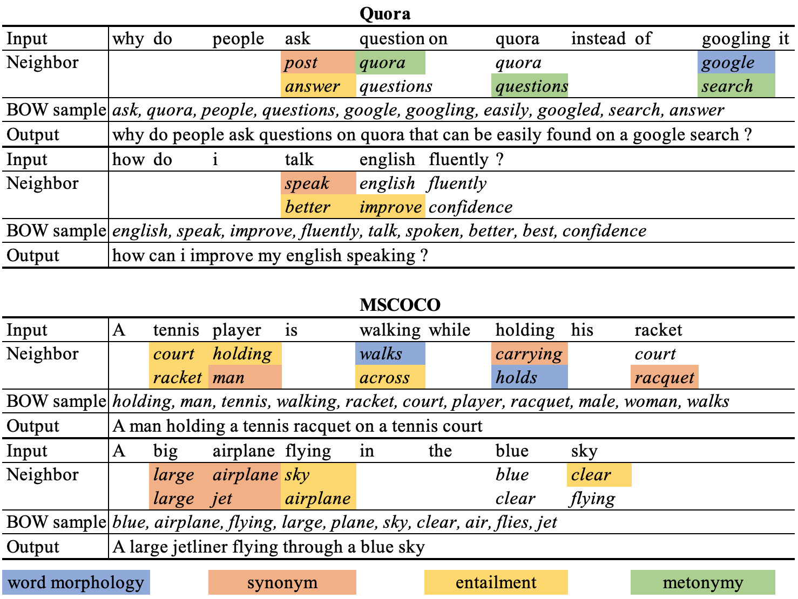

# The Latent Bag of Words Model 

Implementation of Yao Fu, Yansong Feng and John Cunningham, _Paraphrase Generation with Latent Bag of Words_. NeurIPS 2019. [paper](https://github.com/FranxYao/dgm_latent_bow/doc/latent_bow_camera_ready.pdf) 

For more background about deep generative models for natural language processing, see the [DGM4NLP](https://github.com/FranxYao/Deep-Generative-Models-for-Natural-Language-Processing) journal list. 

